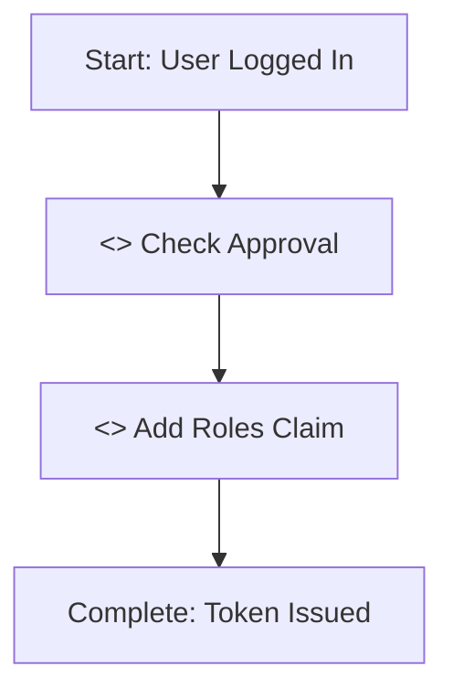

# Setting up an auth0 tenant for GuardianConnector

GuardianConnector uses [Auth0](https://auth0.com/) for authentication and user management. This guide outlines how to configure a new Auth0 tenant for production use.

## GCP OAuth client configuration

> [!IMPORTANT]
>
> Before you start, make sure that you have access to the right project with the OAuth 2.0 Client on GCP.

You will need a Google Cloud Platform (GCP) OAuth 2.0 Client in order to [avoid using development keys which is not recommended](https://community.auth0.com/t/confusing-dev-keys-error-message-when-using-production-keys/74273).

- If you need to create a new Google Cloud Platform (GCP) OAuth 2.0 Client:
  - Create a project on GCP.
  - Navigage to "Clients", and create a Client for a web application.
- If you already have a GCP OAuth 2.0 Client, then you can add the authorized JavaScript origin and redirect URI for your new tenant (per the formats above).
  - You can find your client by navigating to **APIS & Services** -> **OAuth consent screen** -> **Clients**.
- Add the following settings:
  _ Authorized JavaScript origins:
  `https://<tenant>.us.auth0.com`
  _ Authorized redirect URIs:
  `https://<tenant>.us.auth0.com/login/callback`
- Copy down the Client ID and Secret for your client.

## Auth0 tenant configuration, step by step

> [!TIP]
>
> Steps 3, 4, 5, 6, and 7 below can be automated by running `gc-stack-deploy wizard -c stack.yaml`. These are indicated by 🪄 below.
> You'll first need to ["Bootstrap M2M application for the wizard"](#appendix-bootstrap-m2m-application-for-the-wizard)
> to run the wizard.

1. When creating a new Auth0 tenant, you will need to provide a **Tenant Name** for the tenant, which should match the alias chosen by the community.
    - Additionally, select a **Region** (CMI uses US) and **Environment Tag**: "Production".
2. In **Settings** → **Tenant Members**, add the email addresses of the desired tenant administrators (for example, CMI engineering team members and programmatic lead(s)).
3. 🪄 In **Authentication / Social**, enable google-oauth2 under Social Connections. You will need to provide a Client ID and Secret (see [GCP OAuth client configuration](#gcp-oauth-client-configuration)).
4. 🪄 In **Applications**, create a separate Regular Web Application for each tool (e.g., Superset, GC-Explorer).
   - For each application, give a human readable name (e.g. "Superset", "GC-Explorer", "Windmill", "GC Landing Page").
   - Add appropriate production domain values under Callback URLs, Web Origins, and CORS:
   - For **Superset** (assuming Superset is hosted at the root of your subdomain; otherwise, use the appropriate subdomain i.e. `superset.<domain>.guardianconnector.net`):
     - **Callback URL**: `http://superset.<domain>.guardianconnector.net/oauth-authorized/auth0`
       - 🚨 Yes, you are reading that correctly - Superset requires `http://` instead of `https://` for the callback URL. [See this issue for more details](https://github.com/ConservationMetrics/superset-deployment/issues/51).
     - **Allowed Web Origins**: `https://superset.<domain>.guardianconnector.net/`
   - For **GC-Explorer**:
     - **Callback URL**: `https://explorer.<domain>.guardianconnector.net/login`
     - **Allowed Web Origins**: `https://explorer.<domain>.guardianconnector.net`
   - For **Windmill**:
     - **Callback URL**: `https://windmill.<domain>.guardianconnector.net/user/login_callback/auth0`
     - **Allowed Web Origins**: `https://windmill.<domain>.guardianconnector.net/`
     - The wizard prints this client's ID/secret once at the end of its run. Note it down, because there is no `stack.yaml` field to write it.
   - For **GC Landing Page**:
     - **Callback URL**: `https://<domain>.guardianconnector.net/login`
     - **Allowed Web Origins**: `https://<domain>.guardianconnector.net`
5. 🪄 Create a M2M application for metrics with a name like **GC Metrics**, and grant `read:users` and `read:stats` scopes to it. This authorizes the [GC Metrics script](https://github.com/ConservationMetrics/gc-scripts-hub/tree/main/f/metrics/guardianconnector) (which runs in Windmill) against the Auth0 Management API. Follow [**Setting up resources**](/caprover/INSTALL_GC_STACK.md#setting-up-resources) in the stack install guide to add these as a Windmill resource `oauth_client_credentials`. (The wizard prints this client's ID/secret once at the end of its run. Note it down, because there is no `stack.yaml` field to write it.)
6. 🪄 In **Actions**, configure Login Flow Actions for user approval and the roles claim. (See [Flows](#flows) below.)
7. 🪄 Set up **Role-Based Access Control** for the applications that use it. (See [RBAC Configuration](#rbac-configuration) below.)
8. **Sign in** to an auth0 application with at least one user, who will serve as the initial admin user and can manage approval and roles for others using GC Landing Page. This user should be given the **Admin** role, and be approved (see [Auth0 approval process](#auth0-approval-process) below.)
9. (Optional) in **Branding**, a few minor customizations like adding an organization logo and setting the background color to gray #F9F9F9 instead of standard black.

## Flows

### 1. User approval flow

To restrict access until a user is approved, a Post-Login Trigger Action is used in Auth0. This action intercepts login attempts and denies access unless the user’s `app_metadata` includes `"approved": true`.

1. On the Auth0 Page, navigate to **Actions -> Triggers** page.
2. Modify the **Post Login** Flow.
3. Create a custom action using this trigger code (influenced by [the Common Use Cases in the auth0 documentation](https://auth0.com/docs/customize/actions/flows-and-triggers/login-flow#common-use-cases)):

    ```jsx
    exports.onExecutePostLogin = async (event, api) => {
      // Check if the user is approved
      if (event.user.app_metadata && event.user.app_metadata.approved) {
        // User is approved, continue without action
      } else {
        api.access.deny("Your approval to access the app is pending.");
      }
    };
    ```
4. Name the action "Check Approval".
5. Drag the new action into the Login flow (see diagram below).

> [!NOTE]
> 
> This action checks for a variable `approved` in the user's `app_metadata`. If it is not present or is `false`, the user is denied access.
>
> While it is possible to set this value manually in the **User Management** page of auth0, GC Admin users typically do this via the GC Landing Page app. See [Auth0 approval process](#auth0-approval-process) below.

### 2. Add roles claim (Superset)

Superset reads Auth0 RBAC roles from a custom ID-token claim on `/userinfo`. Auth0 rewrites `urn:gc:roles` → `urn.gc.roles` in that response. Create a second Post-Login Action and add it to the same Login flow:

1. On the Auth0 Page, navigate to **Actions -> Triggers** page.
2. Modify the **Post Login** Flow.
3. Create a custom action using this trigger code:

    ```jsx
    exports.onExecutePostLogin = async (event, api) => {
      if (event.authorization) {
        api.idToken.setCustomClaim("urn:gc:roles", event.authorization.roles);
      }
    };
    ```
4. Name the action "Add Roles Claim".

### 3. Drag actions into the flow

Drag both actions into the Post-Login flow, so it looks like this:



## Setting up RBAC

Role-Based Access Control (RBAC) allows you to control user access to different features based on assigned roles. Several of the Guardian Connector applications (e.g. GC Explorer and GC Landing Page) use four roles: **Admin**, **Member**, **Viewer**, and **Public**.

### API Configuration

1. Go to **Dashboard > Applications > APIs** and find the "Auth0 Management API" API
2. For that API, go to the **"Application Access"** tab
3. Find your application in the list and click edit navigating to **Client Credentials** tab.
4. For each application, select the required scopes:
   - **GC-Explorer** (read-only access):
     - `read:users` - to fetch user information
     - `read:user_idp_tokens` - to read user roles
     - `read:roles` and `read:role_members` - to read user roles
   - **GC Landing Page** (user management):
     - `read:users` - to fetch user information
     - `read:roles` - to read available roles
     - `read:role_members` - to read which roles users have
     - `create:role_members` - to assign roles to users
     - `delete:role_members` - to remove roles from users
     - `update:users_app_metadata` - to update user approval status
     - `delete:users` - to remove users

### Role Setup

1. Navigate to **User Management > Roles** in the Auth0 dashboard
2. Click **"+ Create Role"** and create the following roles:
   - **Admin**: "All routes including `/config`"
   - **Member**: "Restricted routes (cannot access `/config`)"
   - **Guest**: "Guest and unrestricted routes only"
   - **SignedIn**: "can access only routes that are set to public"

> [!NOTE]
>
> Users without any assigned roles are assigned the **SignedIn** role by GC Explorer and GC Landing Page.

See the GC Explorer [RBAC documentation](https://github.com/ConservationMetrics/gc-explorer/blob/main/docs/auth.md) for more details on role setup.

### Third Party Applications

In addition to GC Explorer and GC Landing Page, we host several third party applications that have their own role-based access control mechanisms. The extent to which these mechanisms can integrate with those of Guardian Connector varies:

- **Superset**: Superset allows you to synchronize its role definitions with your own. We leverage this functionality to map Guardian Connector roles to those of Superset (Alpha, Gamma, etc.). See the [`superset-deployment` README](https://github.com/conservationMetrics/superset-deployment#user-roles) for more details.
- **Windmill**: Windmill has its own roles -- see [Roles and permissions](https://www.windmill.dev/docs/core_concepts/roles_and_permissions) in their documentation. These roles currently cannot be synchronized with Guardian Connector roles. In practice, we map them conceptually as follows: a Windmill **Administrator** is equivalent to a Guardian Connector **system administrator**, while a Windmill **Operator** is equivalent to a Guardian Connector **Admin**. This means that a GC Admin should be able to run and schedule scripts and flows and access Windmill apps, but should not have access to system-wide Windmill administration. This follows the same principle by which GC Admins are typically not given access to CapRover.
- **CapRover**: CapRover itself does not have any RBAC or single sign-on support.

## Auth0 approval process

1. A user signs up for one of the applications -- typically, the GC Landing Page -- using Auth0, either by email/password or a third-party service (currently, only Google is supported).
2. If the user is not yet approved, they will encounter a message such as:
   - “Your approval to access the app is pending” (GC Landing Page, GC Explorer)
   - “Invalid login” (Superset)
3. A Guardian Connector administrator approves the user and assigns them a role. They can do this using the [User Management](https://docs.guardianconnector.net/reference/gc-toolkit/gc-landing-page/#-user-management) page on the GC Landing Page.
4. Once approved, the user can log in to GuardianConnector services.

## Appendix: Bootstrap M2M application for the wizard

`gc-stack-deploy wizard` talks to the Auth0 Management API on your behalf, authenticated as a
Machine-to-Machine application you create once per tenant:

1. Go to the Auth0 dashboard, **Applications** → **Applications**.
2. Create a new **Machine to Machine Application**, authorized against the **Auth0 Management API**.
3. Grant it the following scopes (so the wizard can manage connections, roles, and actions):
   - `read:clients create:clients create:client_keys create:client_grants update:clients`
   - `read:connections create:connections update:connections`
   - `read:client_grants update:client_grants`
   - `read:roles create:roles`
   - `read:actions create:actions update:actions`
4. Copy down the Client ID and Secret. The wizard will prompt for these along with your tenant domain.
