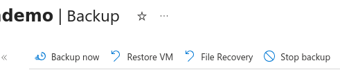

# Recover from Backup

This documentation assumes you've set up Azure Backup on a VM (which needs to be have been done manually).

Use [Recover VM](#recover-vm) when you need to quickly restore an entire disk or the VM itself.

Use [File Recovery](#file-recovery) for targeted extraction of specific files (rate-limited to 1GB/hour).

## Recover VM

Use Recover VM when you need to quickly restore an entire disk or the VM itself.

There are [at least](https://learn.microsoft.com/en-us/azure/backup/backup-azure-arm-restore-vms#restore-options) two ways to recover entire hard disk from backup.

### Restore target: Replace existing disks

This is likely the one you want.

It restores a backed up hard disk to a new disk, which will replace the disk on the existing VM.

Use when:
- The VM still exists and is accessible. If it's been deleted, this option can't be used.
- You want to preserve the VM's identity, for example IP (and therefore DNS settings), resource name in Azure.
- Minimal reconfiguration needed post-restore

## How to do it

1. You will need a Staging Storage Account:
    - This storage account must use flat blob storage (a.k.a."hierarchical namespace" disabled, a.k.a. Cannot be "ADLSv2"). Note that our community data warehouse accounts are all ADLSv2 so they cannot be used for this.
    - **It needs to be in the same Azure region and the same Subscription as the VM.**
        - CMI Staff: If your VM is in East US 2 and Subscription `CMI_Guardian`, use storage account `vmrestorestaginguseast2`, which we leave on-standby for you. However to restore VMs in other regions or other Subscriptions, you need to create a new storage account.
1. In Azure Portal, find the VM. Click "Backup".
1. Click **"Recover VM"**
1. Select a restore point, then `Restore target: **"Replace Existing"**`
1. Select the Staging Storage Account from above. It's suggested to uncheck "Skip pre-restore backup" but use your gut.
1. Click the **Restore** button.

Follow-up:
- Azure took a pre-replacement snapshot (retained in Backups). If ever you need to undo the restore, maybe you can use this.
- The original hard disk is retained in the resource group. Once recovery was successful, delete this disk manually.

### Restore target: Create new VM

Quickly spins up a new VM from a restore point.
You will specify a new name for the new VM and select the resource group and virtual network (VNet) in which it will be placed.

Use when:
- You need the old VM running alongside the restored version (e.g., for comparison, staged migration)
- You want to restore to a different VNet or resource group (must remain in same region)
- You are just testing recovery.

As this is not the common case, we will just point you to the official documentation.

# File Recovery

Use File Recovery for targeted extraction of specific files, such as the PostgreSQL data dir or an environment variable from `config-captain.json`. It's rate-limited to 1GB/hour so not a reasonable solution for full VM recovery.

[Official documentation](https://learn.microsoft.com/en-us/azure/backup/backup-azure-restore-files-from-vm)

## What it does

It adds a local volume to remote backup, for every volume on the VM. Example:

    ************ Volumes of the recovery point and their mount paths on this machine ************
    Sr.No.  |  Disk     |  Volume     |  MountPath
    1)      | /dev/sdc  |  /dev/sdc1  |  /home/cmiadmin/demo-20260120174605/Volume1
    2)      | /dev/sdc  |  /dev/sdc15 |  /home/cmiadmin/demo-20260120174605/Volume3
    3)      | /dev/sdc  |  /dev/sdc16 |  /home/cmiadmin/demo-20260120174605/Volume4

Note that transfer of files from these volumes is rate-limited (1GB/hour) so use only if you need to recover a targeted few files.

These all get mounted as `root` user, so to get into them you need to login as root:

    $ sudo su -
    # cd /home/cmiadmin

In practice only ONE of these volume backups is the OS Disk, i.e only one is useful to you (was `Volume1` when I tried it).

    # ls demo-20260120174605/Volume1/
    bin  bin.usr-is-merged  boot  captain  dev  etc  home  lib  lib.usr-is-merged
    lib64  lost+found  media  mnt  opt  proc  root  run  sbin  sbin.usr-is-merged
    snap  srv  sys  tmp  usr  var

### Examples

If your caprover got corrupted, you could copy `Volume1/captain/data/config-captain.json` into your primary OS Disk.

If your PostgreSQL database got corrupted, you could copy `Volume1/var/lib/docker/volumes/captain--postgres-redis-data` onto your primary OS Disk.

## How to do it

1. In Azure Portal, find the VM. Click "Backup".
1. Click **"File Recovery"**
1. Select restore point, click Download script.
1. Download Script
1. Get the script onto the VM:
    scp ./largedisk_0_guardian-XXX.py  cmiadmin@captain.XXX.guardianconnector.net:/home/cmiadmin/
1. SSH yourself into the VM:
    scp cmiadmin@captain.XXX.guardianconnector.net

1. Run the script. It will prompt you for the VM admin password, and also for the password shown in the portal.

    python3 ./largedisk_0_guardian-XXX.py

1. As shown above, `sudo su -` and `cd` into the backed-up disk volume.

## How to cleanup afterwards

After recovery, remove the disks and close the connection to the recovery point by clicking the 'Unmount Disks' button from the portal or by using the relevant unmount command in case of powershell or CLI.

After unmounting disks, run the script with the parameter 'clean' to remove the mount paths of the recovery point from this machine.

    python3 ./largedisk_0_guardian-XXX.py clean
